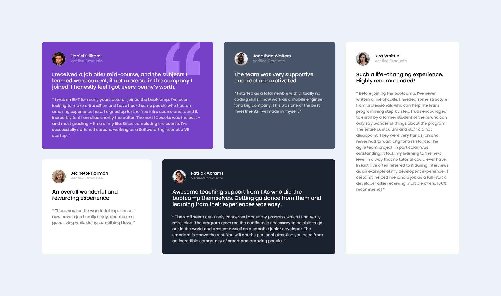
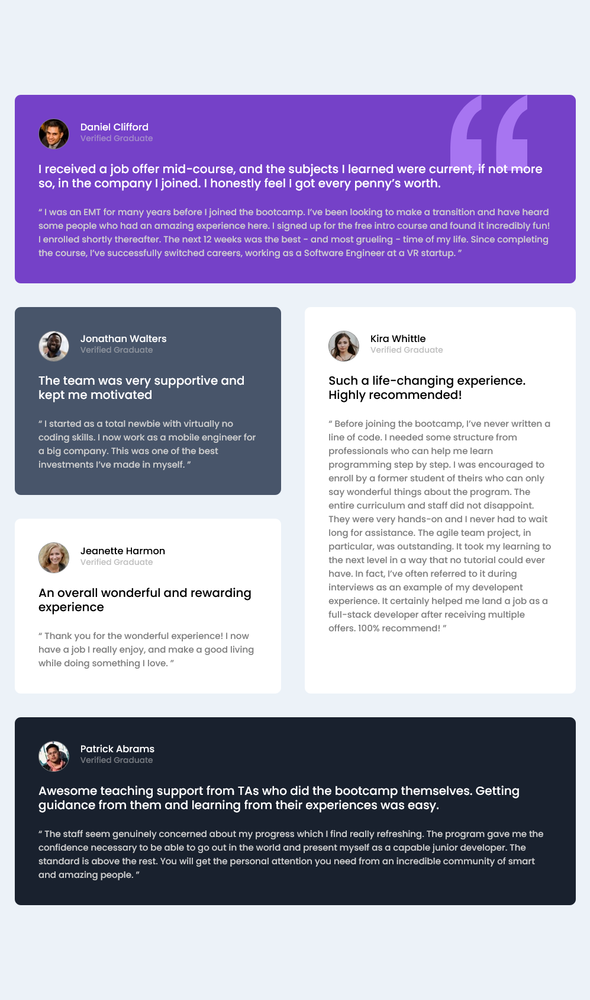
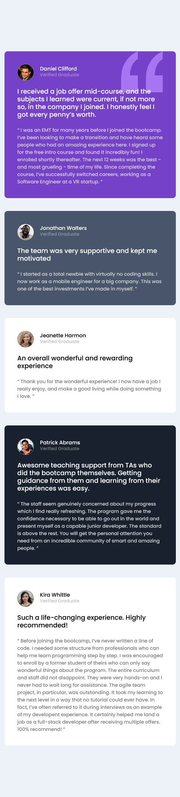

# Frontend Mentor - Testimonials grid section solution

This is a solution to the [Testimonials grid section challenge on Frontend Mentor](https://www.frontendmentor.io/challenges/testimonials-grid-section-Nnw6J7Un7). Frontend Mentor challenges help you improve your coding skills by building realistic projects. 

## Table of contents

- [Overview](#overview)
  - [The challenge](#the-challenge)
  - [Screenshot](#screenshot)
  - [Links](#links)
- [My process](#my-process)
  - [Built with](#built-with)
  - [What I learned](#what-i-learned)
  - [Continued development](#continued-development)
- [Author](#author)

## Overview

### The challenge

Users should be able to:

- View the optimal layout for the site depending on their device's screen size

### Screenshot

### Links

- Solution URL:  (https://github.com/Ghazali-Sufi/testimonials-grid-section)
- Live Site URL: (https://testimonial-section-site.netlify.app/)

## My process

### Built with

- Semantic HTML5 markup
- CSS and SCSS custom properties
- Flexbox
- CSS Grid
- Mobile-first workflow
- JavaScript

### What I learned

In working on this project, I have learned how to effectively use a grid system to organize content on a webpage, ensuring that each section, like testimonials, is neatly placed according to a defined area. I've applied Google Fonts to enhance the typography, making the content visually appealing and easy to read. Through setting variables for colors, I've simplified the process of maintaining and updating the CSS, which makes it easier to manage the overall design. I've also mastered incorporating media queries to ensure the layout adapts to different screen sizes, making the website responsive. This project has significantly improved my skills in web design and CSS.

### Continued development

In future projects, I want to get better at several things. First, I will work more with the CSS grid system to arrange website content better, especially when the layout is complex. I also want to improve how websites look on different devices, like phones or tablets, by learning more about responsive design. I'll focus on using CSS variables more, which help make changes easier and quicker. Besides, I want to make websites faster and learn how to use tools that check website performance. Lastly, I'm interested in adding fun animations and effects to make websites more interesting. By focusing on these areas, I hope to make websites that not only look good but also work well and are enjoyable to use.

## Author

- Github - [Mohamed Ghazali](https://github.com/Ghazali-Sufi)
- Frontend Mentor - [@MGhazali](https://www.frontendmentor.io/profile/Ghazali-Sufi)
- LinkedIn - [@MGhazali](https://www.linkedin.com/in/mghazaali)
- Facebook - [@MGhazali](https://www.facebook.com/MGhazaali)

